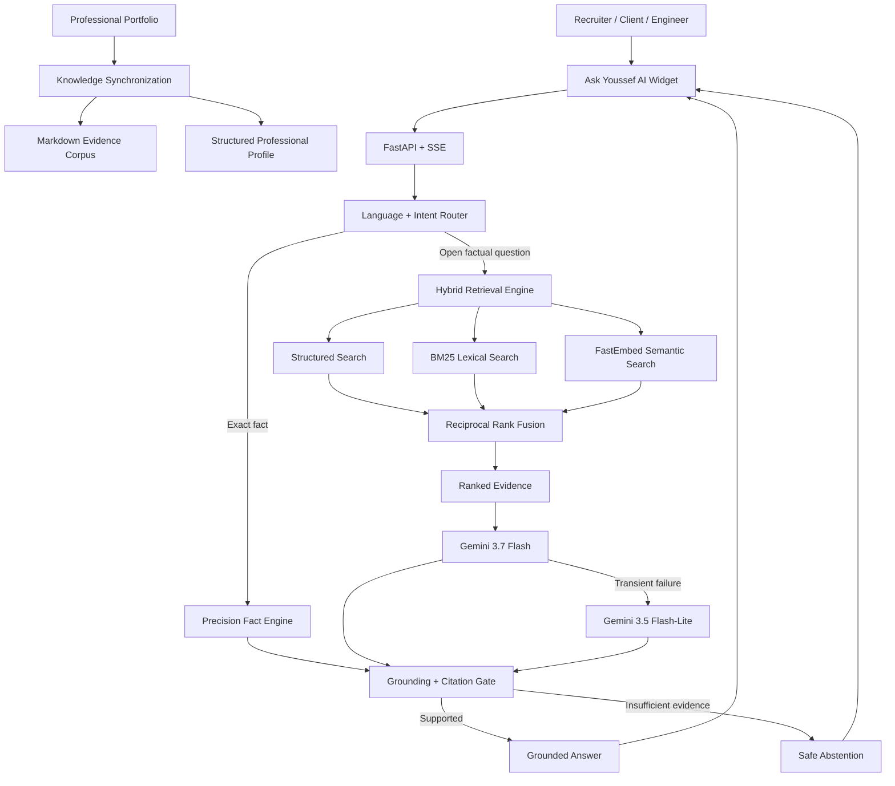

<div align="center">

# ASK-YOUSSEF-AI

### Evidence-Grounded AI Portfolio Intelligence System

**Hybrid RAG • Structured Retrieval • Deterministic Reasoning • Multilingual AI • Production Evaluation • Security Engineering**

A live AI system engineered by **Youssef Bouzit** to turn a professional portfolio into an interactive, evidence-grounded interface for recruiters, clients, engineers and collaborators.

<br />

[](https://youssef-bt.github.io/)
[](https://ask-youssef-ai.vercel.app/)
[](https://youssef-bt.github.io/)
[](https://www.linkedin.com/in/youssef-bouzit-74863239b/)

<br />


</div>

---

## Why This Project Matters

A portfolio normally forces a recruiter or client to manually inspect projects, experience, skills, certifications and technical pages.

**Ask Youssef AI turns that static portfolio into a queryable professional intelligence layer.**

Visitors can ask questions such as:

> What is Youssef's strongest Computer Vision project?

> What evidence supports his RAG experience?

> Has he worked professionally with AI?

> Which projects demonstrate production engineering?

> What technologies has he used with FastAPI, PostgreSQL or MLOps?

> Is he currently open to a full-time AI/ML role?

The system does not rely on generic model memory. It retrieves synchronized portfolio evidence, resolves exact facts deterministically when possible, generates a response, validates grounding and returns citations or a safe abstention.

---

## Engineering Impact — At a Glance

<table>
<tr>
<td align="center"><strong>218 / 218</strong><br/>Unit & regression tests</td>
<td align="center"><strong>25 / 25</strong><br/>Core production regression</td>
<td align="center"><strong>20 / 20</strong><br/>Adversarial production audit</td>
<td align="center"><strong>21 / 21</strong><br/>Human professional audit</td>
</tr>
<tr>
<td align="center"><strong>3 languages</strong><br/>EN • FR • AR</td>
<td align="center"><strong>161 chunks</strong><br/>Retrieval corpus</td>
<td align="center"><strong>81 docs</strong><br/>Structured retrieval documents</td>
<td align="center"><strong>56 certs</strong><br/>Deterministically queryable</td>
</tr>
</table>

Additional deterministic benchmark results:

| Metric | Verified Result |
|---|---:|
| Routing accuracy | **1.000** |
| Retrieval Hit@1 | **1.000** |
| Retrieval Hit@3 | **1.000** |
| Retrieval MRR | **1.000** |
| Grounding safety | **1.000** |
| Profile integrity | **1.000** |

> These scores describe fixed evaluation suites and regression contracts, not universal LLM accuracy.

---

## What Makes It More Than a Chatbot

Ask Youssef AI combines several engineering layers that are usually treated separately:

| Layer | Engineering Capability |
|---|---|
| **Knowledge Engineering** | Automatic portfolio synchronization into Markdown evidence + structured JSON |
| **Hybrid Retrieval** | Structured search + BM25 + FastEmbed semantic retrieval |
| **Rank Fusion** | Reciprocal Rank Fusion with deterministic evidence boosts |
| **Precision Reasoning** | Exact facts resolved from the full structured profile instead of partial top-k context |
| **LLM Orchestration** | Gemini primary model with bounded retries, timeout handling and fallback model |
| **Grounding** | Citation validation, literal checks, unsupported-claim protection and safe abstention |
| **Multilingual AI** | Hard EN / FR / AR output-language contract, including follow-up turns |
| **Backend Engineering** | FastAPI, SSE streaming, validation, rate limits and production health endpoints |
| **Quality Engineering** | Offline benchmarks, unit tests, production regressions, adversarial audits and human QA |
| **Security Engineering** | Server-side secrets, origin controls, dependency auditing and CodeQL |
| **Production Delivery** | GitHub Actions + Vercel + live portfolio widget integration |

---

# System Architecture



### Core design principle

**Use deterministic logic where precision matters, retrieval where evidence matters, and generation where language reasoning adds value.**

---

## 1. Hybrid Retrieval Engine

The system deliberately avoids vector-only retrieval.

```text
Structured Professional Search
            +
           BM25
            +
   FastEmbed Semantic Search
            ↓
   Reciprocal Rank Fusion
            ↓
 Deterministic Evidence Boosts
            ↓
       Ranked Context
```

Why this matters:

- **Structured search** is strong for projects, employers, skills, certifications and exact profile entities.
- **BM25** is strong for identifiers such as `YOLOv11`, `BoT-SORT`, `FastAPI`, company names and certification titles.
- **Semantic retrieval** handles conceptual questions even when the visitor uses different wording from the portfolio.
- **RRF** combines the strengths of all retrieval channels without trusting a single ranking source.

---

## 2. Precision Fact Engine

Some professional questions should never depend on an LLM interpreting a small retrieval window.

Examples:

```text
How many certifications does Youssef have?
Which Oracle certifications has he earned?
Where did he work?
How many projects are in the portfolio?
What is his current professional status?
Is he currently seeking a full-time role?
```

These questions are resolved against the **complete synchronized structured profile**.

This prevents common RAG failure modes such as:

- counting only retrieved top-k results;
- confusing certification issuers with employers;
- inventing missing professional facts;
- treating partial evidence as the complete profile.

---

## 3. Evidence-Grounded Generation

Professional answers should be defensible.

The grounding layer validates or constrains:

- source IDs;
- citations;
- important numeric claims;
- URLs and published contact information;
- unsupported employers;
- unsupported professional claims;
- invented private information.

When evidence is insufficient, the expected behavior is:

**abstain instead of fabricate.**

Retrieved portfolio content is treated as untrusted data, not as privileged instructions.

---

## 4. Multilingual AI Contract

Ask Youssef AI supports:

<div align="center">

### 🇬🇧 English &nbsp;&nbsp; • &nbsp;&nbsp; 🇫🇷 Français &nbsp;&nbsp; • &nbsp;&nbsp; 🇲🇦 العربية

</div>

The current visitor question determines the response language, including history-aware follow-ups.

Technical identifiers remain canonical when appropriate:

`YOLOv11` • `BoT-SORT` • `FastAPI` • `RAG` • `BM25` • `FastEmbed` • `MLOps`

This behavior is protected by regression tests rather than left as a soft prompt preference.

---

## 5. Reliability & Failover

```text
Gemini 3.7 Flash
       │
       ├── success ─────────────────┐
       │                            │
       └── transient provider issue │
                    ↓               │
         Gemini 3.5 Flash-Lite      │
                    │               │
                    └───────────────┘
                            ↓
                   Grounding Gate
                            ↓
                    Final Response
```

The runtime also includes:

- bounded provider timeouts;
- bounded retries;
- provider failure detection;
- deterministic paths that bypass the LLM when generation is unnecessary;
- evidence-based fallback behavior;
- request-size limits;
- bounded conversation history;
- process-level rate limiting;
- health monitoring.

---

## 6. Knowledge Synchronization

The public portfolio remains the professional **source of truth**.

The synchronization pipeline generates two complementary representations:

```text
Professional Portfolio
        │
        ▼
Knowledge Synchronization
        │
        ├── Markdown Evidence Corpus
        │
        └── Structured Professional Profile
```

Current synchronized snapshot:

| Entity | Count |
|---|---:|
| Projects | **10** |
| Skill categories | **6** |
| Certifications | **56** |
| Professional experiences | **2** |
| Education entries | **2** |
| Public professional links | **4** |
| Evidence pages | **16** |
| Retrieval chunks | **161** |
| Structured documents | **81** |

The synchronization workflow validates data integrity before committing generated knowledge updates.

---

# Evaluation Strategy

The project uses layered validation instead of a single self-reported AI score.

### Deterministic evaluation

- routing accuracy;
- retrieval Hit@1 / Hit@3;
- MRR;
- grounding safety;
- structured-profile integrity.

### Production regression

- career-state behavior;
- multilingual responses;
- professional facts;
- project ranking;
- certification inventories;
- unsupported-employer handling;
- citations;
- conversational follow-ups.

### Adversarial evaluation

- prompt injection;
- secret extraction attempts;
- false citation pressure;
- unsupported salary/address/private details;
- multilingual ambiguity;
- hallucinated employers;
- scope abuse.

### Human professional audit

The final system was also tested from the perspective of:

- recruiters;
- clients;
- normal portfolio visitors.

See [`docs/evaluation.md`](docs/evaluation.md) for methodology and scope.

---

# Security Engineering

Security is part of the architecture, not an afterthought.

The project includes:

- provider secrets stored server-side only;
- production origin restrictions;
- bounded user input and history;
- strict conversation roles;
- prompt/secret-exfiltration refusal;
- unsupported-claim protection;
- citation integrity checks;
- exact direct dependency pins;
- Python 3.12 runtime pinning;
- Dependabot;
- `pip-audit`;
- GitHub CodeQL;
- automated security regressions.

The system deliberately does **not** claim enterprise-scale security guarantees that have not been implemented.

See [`SECURITY.md`](SECURITY.md) and [`docs/security.md`](docs/security.md).

---

# Production Stack

<div align="center">

### AI & Retrieval


### Backend


### Delivery & Quality


</div>

---

## Production Status

```yaml
project: Ask Youssef AI
status: live
engineer: Youssef Bouzit
runtime: Python 3.12
backend: FastAPI
streaming: Server-Sent Events
hosting: Vercel
retrieval: Structured + BM25 + FastEmbed + RRF
primary_model: Gemini 3.7 Flash
fallback_model: Gemini 3.5 Flash-Lite
languages:
  - English
  - French
  - Arabic
```

### Live endpoints

- **Portfolio experience:** https://youssef-bt.github.io/
- **Production API:** https://ask-youssef-ai.vercel.app/
- **Health:** https://ask-youssef-ai.vercel.app/health
- **API docs:** https://ask-youssef-ai.vercel.app/docs

---

## Repository Structure

```text
ASK-YOUSSEF-AI/
├── app.py
├── backend/
│   ├── app.py
│   ├── agent.py
│   ├── rag.py
│   ├── router.py
│   ├── grounding.py
│   ├── precision_facts.py
│   ├── structured_facts.py
│   ├── observability.py
│   ├── retrieval/
│   └── data/
├── evaluation/
├── tests/
├── scripts/
├── web/
├── docs/
├── .github/
├── requirements.txt
├── vercel.json
├── SECURITY.md
└── LICENSE
```

---

## Documentation

| Document | Scope |
|---|---|
| [`docs/architecture.md`](docs/architecture.md) | System design, routing, retrieval, generation and grounding |
| [`docs/evaluation.md`](docs/evaluation.md) | Quality gates, benchmarks, production regression and adversarial QA |
| [`docs/security.md`](docs/security.md) | Security boundaries, privacy and supply-chain controls |
| [`docs/deployment.md`](docs/deployment.md) | Production runtime, Vercel topology and operations |
| [`SECURITY.md`](SECURITY.md) | Responsible vulnerability reporting |

---

# What This Project Shows About My Engineering

This project demonstrates my ability to work across the full AI application lifecycle:

**Data & Knowledge Engineering**  
Portfolio synchronization, structured schemas, deterministic extraction and evidence management.

**AI / RAG Engineering**  
Hybrid retrieval, rank fusion, model orchestration, grounding and hallucination control.

**Backend Engineering**  
FastAPI, validation, SSE streaming, error handling, health endpoints and rate controls.

**AI Quality Engineering**  
Unit tests, offline benchmarks, production regressions, adversarial evaluation and human QA.

**MLOps / Production Delivery**  
CI/CD, dependency security, Vercel deployment, runtime monitoring and reproducible configuration.

---

<div align="center">

## Youssef Bouzit

### State Engineer in Data Science

**AI / Machine Learning • Computer Vision • RAG / LLM Systems • MLOps**

I build practical AI systems that connect **models, data, software architecture, evaluation and production delivery**.

<br />

[](https://youssef-bt.github.io/)
[](https://www.linkedin.com/in/youssef-bouzit-74863239b/)
[](https://github.com/YOUSSEF-BT)

<br />

### Evidence before claims. Evaluation before confidence. Engineering before hype.

</div>

---

## License

MIT License — see [`LICENSE`](LICENSE).
