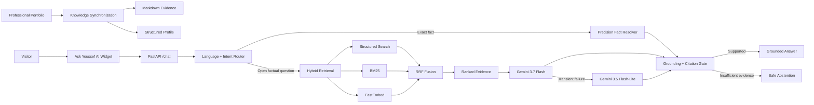

<div align="center">

# Ask Youssef AI

### Production AI Portfolio Copilot

**Hybrid Retrieval • Grounded Generation • Multilingual AI • Evaluation • Deployment**

A production AI system built by **Youssef Bouzit** to make a professional engineering portfolio directly queryable through natural language while keeping answers connected to verifiable evidence.

<br />

[](https://youssef-bt.github.io/)
[](https://ask-youssef-ai.vercel.app/)
[](https://youssef-bt.github.io/)
[](https://www.linkedin.com/in/youssef-bouzit-74863239b/)

<br />


</div>

---

## What This Project Demonstrates

Ask Youssef AI is an end-to-end AI engineering project that connects **data synchronization, hybrid retrieval, deterministic reasoning, LLM generation, grounding, evaluation, security and production delivery** in one system.

It is designed for real portfolio visitors:

- **Recruiters** can inspect professional experience, projects and technical strengths.
- **Clients** can evaluate RAG, Computer Vision, Machine Learning and delivery evidence.
- **Engineers** can explore architecture, retrieval design and production decisions.
- **Collaborators** can quickly understand the scope of Youssef's work.

The goal is not to generate promotional text. The goal is to produce **useful professional answers grounded in synchronized evidence**.

---

## Engineering Snapshot

| Area | Implementation |
|---|---|
| **Knowledge source** | Synchronized professional portfolio |
| **Retrieval** | Structured profile + BM25 + FastEmbed semantic search |
| **Fusion** | Reciprocal Rank Fusion with deterministic evidence boosts |
| **Exact facts** | Structured precision-fact resolver |
| **Generation** | Gemini 3.7 Flash with Gemini 3.5 Flash-Lite failover |
| **Grounding** | Citation validation, unsupported-claim checks, safe abstention |
| **Backend** | FastAPI + Python 3.12 + Server-Sent Events |
| **Languages** | English, French and Arabic |
| **Production** | Vercel + GitHub Actions |
| **Security** | CodeQL, pip-audit, exact dependency pins, runtime safeguards |
| **Evaluation** | Unit, regression, production, adversarial and human QA |

---

## Architecture



The design deliberately separates **deterministic logic** from **generative reasoning**. Exact counts, inventories and employer checks do not depend on probabilistic generation; open-ended questions use retrieval plus generation.

---

## Key Engineering Decisions

### Hybrid retrieval instead of vector-only search

Professional portfolios contain exact names, technologies, companies, certification issuers and semantic concepts. A single retrieval method is not equally strong across all of them.

```text
Structured Search + BM25 + FastEmbed
                ↓
       Reciprocal Rank Fusion
                ↓
          Ranked Evidence
```

### Deterministic precision facts

Questions such as certification totals, employer checks, project counts and current professional status are resolved against the complete structured profile rather than a partial top-k retrieval result.

### Evidence before claims

Factual portfolio turns require professional evidence. The system validates citations and important literals, and it prefers abstention over unsupported claims.

### Language as a hard contract

The current visitor question controls the final response language in **English, French or Arabic**, including history-aware follow-ups.

### Reliability beyond a single provider call

The production path includes bounded retries, timeouts, model failover and evidence-based fallback behavior.

---

## Knowledge Base

The public portfolio is the professional source of truth. Synchronization generates both retrieval evidence and a structured representation for exact facts.

| Synchronized Entity | Current Snapshot |
|---|---:|
| Projects | **10** |
| Skill categories | **6** |
| Certifications | **56** |
| Professional experiences | **2** |
| Education entries | **2** |
| Public professional links | **4** |
| Evidence pages | **16** |
| Retrieval chunks | **161** |
| Structured documents | **81** |

---

## Verified Quality

Ask Youssef AI is evaluated through multiple independent layers rather than one vague accuracy score.

| Validation Layer | Verified Result |
|---|---:|
| Python unit & regression suite | **218 / 218** |
| Routing accuracy | **1.000** |
| Retrieval Hit@1 | **1.000** |
| Retrieval Hit@3 | **1.000** |
| Retrieval MRR | **1.000** |
| Grounding safety | **1.000** |
| Profile integrity | **1.000** |
| Career-state production regression | **3 / 3** |
| Core production regression | **25 / 25** |
| Deep adversarial production audit | **20 / 20** |
| Human recruiter/client/visitor audit | **21 / 21** |
| Targeted client regressions | **2 / 2** |

These figures describe defined regression suites and evaluation contracts. They are not presented as universal 100% LLM accuracy.

See [`docs/evaluation.md`](docs/evaluation.md) for scope and methodology.

---

## Security & Reliability

The public system includes:

- server-side secret storage;
- browser-origin restrictions;
- bounded request and history sizes;
- strict conversation roles;
- prompt/secret-exfiltration refusal;
- citation integrity checks;
- unsupported-claim protection;
- per-IP and global usage limits;
- Python 3.12 runtime pinning;
- exact direct dependency versions;
- Dependabot;
- `pip-audit`;
- GitHub CodeQL;
- automated security regressions.

See [`SECURITY.md`](SECURITY.md) and [`docs/security.md`](docs/security.md).

---

## Technology Stack

<div align="center">


</div>

---

## Production

- **Live portfolio:** https://youssef-bt.github.io/
- **Production API:** https://ask-youssef-ai.vercel.app/
- **Health endpoint:** https://ask-youssef-ai.vercel.app/health
- **API documentation:** https://ask-youssef-ai.vercel.app/docs

The production service currently reports a healthy synchronized index with **16 evidence pages, 161 chunks and 81 structured documents**.

---

## Documentation

| Document | Purpose |
|---|---|
| [`docs/architecture.md`](docs/architecture.md) | System design and retrieval architecture |
| [`docs/evaluation.md`](docs/evaluation.md) | Evaluation methodology and quality gates |
| [`docs/security.md`](docs/security.md) | Security and privacy architecture |
| [`docs/deployment.md`](docs/deployment.md) | Production deployment and operations |
| [`SECURITY.md`](SECURITY.md) | Responsible vulnerability reporting |

---

## About the Engineer

<div align="center">

### Youssef Bouzit

**State Engineer in Data Science**

AI / Machine Learning • Computer Vision • RAG / LLM Systems • MLOps

I build AI systems that connect **models, data, retrieval, backend engineering, evaluation and production delivery**.

<br />

[](https://youssef-bt.github.io/)
[](https://www.linkedin.com/in/youssef-bouzit-74863239b/)
[](https://github.com/YOUSSEF-BT)

</div>

---

<div align="center">

### Ask Youssef AI

**Evidence-grounded AI engineered for a real production portfolio.**

</div>
