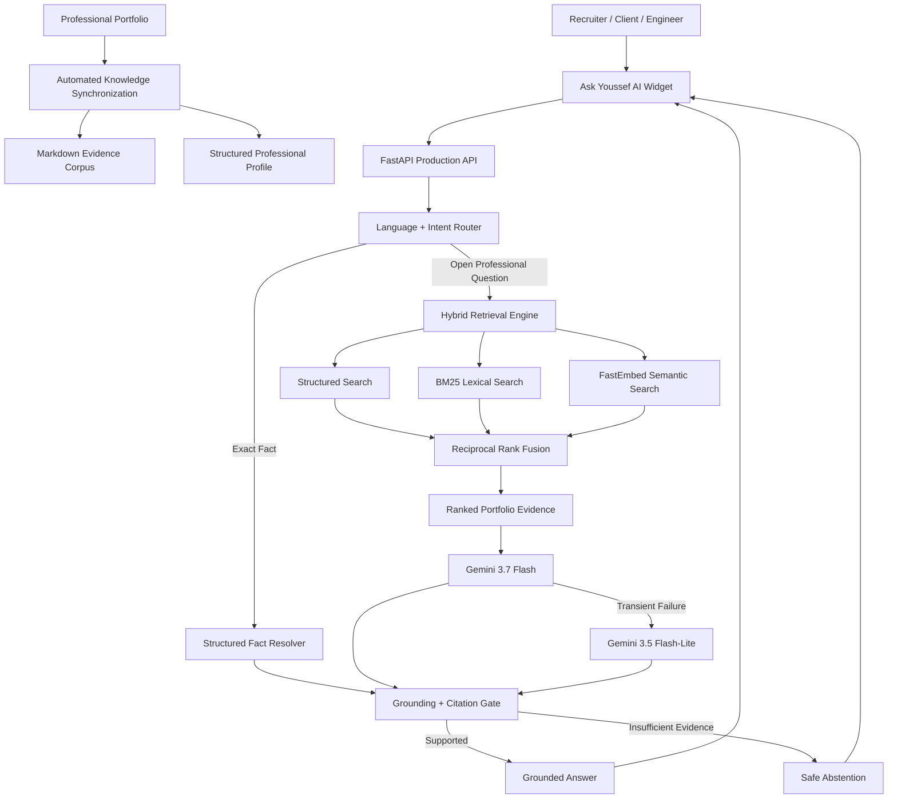

<div align="center">

# Ask Youssef AI

### Evidence-Grounded AI Portfolio Copilot

**Hybrid RAG • Structured Retrieval • Agentic Orchestration • Multilingual AI • Grounding • Production Evaluation**

A production AI system engineered by **Youssef Bouzit** to transform a professional portfolio into an interactive, evidence-grounded knowledge interface for recruiters, clients, engineers and collaborators.

<br />

[](https://youssef-bt.github.io/)
[](https://ask-youssef-ai.vercel.app/)
[](https://youssef-bt.github.io/)
[](https://www.linkedin.com/in/youssef-bouzit-74863239b/)

<br />


</div>

---

## What I Engineered

Ask Youssef AI is not a generic chatbot attached to a portfolio.

I designed it as an **end-to-end AI engineering system** combining:

- synchronized professional-knowledge ingestion;
- structured professional-profile generation;
- semantic retrieval;
- BM25 lexical retrieval;
- structured field-aware retrieval;
- Reciprocal Rank Fusion;
- deterministic precision-fact resolution;
- multilingual intent and language routing;
- LLM orchestration;
- citation and grounding validation;
- hallucination controls;
- provider failover;
- production observability;
- security boundaries;
- automated regression testing;
- adversarial evaluation;
- CI/CD;
- serverless production deployment;
- portfolio frontend integration.

The result is a system that can answer professional questions about my work while remaining connected to verifiable portfolio evidence.

---

## The Problem

A professional engineering portfolio can contain dozens of projects, certifications, technical metrics, technologies and experience details.

Most recruiters and clients will never inspect all of them manually.

Ask Youssef AI converts that static information into an intelligent interface.

Instead of navigating multiple pages, a visitor can ask questions such as:

> What is Youssef's strongest Computer Vision project?

> What evidence supports his RAG experience?

> Has he worked professionally with AI?

> Which projects demonstrate production engineering?

> Which Oracle certifications has he earned?

> Is he currently open to a full-time position?

The system retrieves evidence from the real portfolio and produces a grounded response.

---

## System Architecture



The architecture separates deterministic components from generative reasoning.

LLMs are used where language understanding and generation add value. Structured logic is used where precision matters more than creativity.

See [`docs/architecture.md`](docs/architecture.md) for the deeper design.

---

## Hybrid Retrieval Engine

Ask Youssef AI does not depend on a single vector-search result.

Its retrieval architecture combines three complementary signals:

```text
Structured Professional Profile
              +
            BM25
              +
     FastEmbed Semantic Search
              ↓
     Reciprocal Rank Fusion
              ↓
   Evidence-aware reranking
              ↓
      Grounded context
```

### Structured retrieval

Handles entities such as:

- companies;
- projects;
- technologies;
- certifications;
- education;
- experience;
- professional links.

### BM25

Strong for exact lexical information such as:

- `YOLOv11s`;
- `BoT-SORT`;
- `Oracle`;
- project names;
- company names;
- technical identifiers.

### Semantic retrieval

FastEmbed enables conceptual search when the visitor uses vocabulary different from the original portfolio content.

### Reciprocal Rank Fusion

RRF combines the retrieval channels instead of trusting a single ranking system. This makes the retriever more robust across recruiter, client and technical questions.

---

## Precision Fact Engine

Not every question should be answered by an LLM.

Questions such as:

```text
How many certifications does Youssef have?
Which Oracle certifications has he earned?
Where did he work?
How many projects are in the portfolio?
What is his current professional status?
Is he looking for a full-time role?
```

are resolved against the complete structured professional profile.

This prevents an LLM from:

- counting incomplete top-k results;
- confusing certification issuers with employers;
- inventing missing professional information;
- treating partial retrieval as the complete profile.

---

## Evidence-Grounded Generation

Professional claims are expected to come from evidence.

The response pipeline applies deterministic checks after generation. It verifies or constrains:

- source identifiers;
- citations;
- important numeric claims;
- URLs;
- published contact information;
- employer claims;
- project facts;
- unsupported high-impact assertions.

When sufficient evidence is unavailable, the preferred behavior is:

> **abstain rather than fabricate.**

Retrieved portfolio text is treated as **untrusted data**, not as instructions capable of overriding the application's security rules.

---

## Multilingual AI

Ask Youssef AI supports:

**English • Français • العربية**

Language detection happens before generation.

The response language follows the visitor's current question, while technical identifiers remain canonical where appropriate:

```text
YOLOv11
BoT-SORT
FastAPI
RAG
BM25
FastEmbed
Gemini
MLOps
```

The multilingual behavior is protected by regression tests, including history-aware follow-up questions.

---

## Knowledge Synchronization

The public portfolio is the professional **source of truth**.

The synchronization pipeline converts portfolio information into two complementary representations:

```text
Professional Portfolio
        │
        ▼
Synchronization Pipeline
        │
        ├── Markdown Evidence Corpus
        │
        └── Structured Professional Profile
```

Current synchronized snapshot:

| Knowledge Entity | Current Snapshot |
|---|---:|
| Projects | **10** |
| Skill categories | **6** |
| Certifications | **56** |
| Professional experiences | **2** |
| Education entries | **2** |
| Public professional links | **4** |
| Evidence pages | **16** |
| Retrieval chunks | **161** |
| Structured documents | **81** |

The knowledge base can evolve as the public portfolio changes.

---

## Reliability Engineering

The production generation path includes provider failover:

```text
Gemini 3.7 Flash
        │
        ├── Success ──────────────┐
        │                         │
        └── Provider Failure      │
                 │                │
                 ▼                │
      Gemini 3.5 Flash-Lite       │
                 │                │
                 └────────────────┘
                         │
                         ▼
                Grounding Gate
```

The runtime also includes:

- bounded model timeouts;
- bounded generation retries;
- provider-failure detection;
- evidence-based fallback behavior;
- deterministic responses where an LLM is unnecessary;
- request-size limits;
- bounded conversation history;
- rate limiting;
- production health monitoring.

Exact structured questions can bypass the generative model completely.

---

## Evaluation

The system is evaluated at multiple levels rather than relying on a vague "AI accuracy" score.

| Validation Layer | Verified Result |
|---|---:|
| Python unit & regression tests | **218 / 218** |
| Routing accuracy | **1.000** |
| Retrieval Hit@1 | **1.000** |
| Retrieval Hit@3 | **1.000** |
| Retrieval MRR | **1.000** |
| Grounding safety | **1.000** |
| Profile integrity | **1.000** |
| Career-state production regression | **3 / 3** |
| Core production regression | **25 / 25** |
| Deep adversarial production audit | **20 / 20** |
| Human recruiter/client/visitor audit | **21 / 21** |
| Final targeted client regressions | **2 / 2** |

The tests cover areas such as:

- factual professional questions;
- multilingual behavior;
- recruiter-style comparisons;
- project ranking;
- certification inventories;
- current professional status;
- unsupported employers;
- private-information requests;
- false-citation pressure;
- prompt injection;
- secret-extraction attempts;
- conversational follow-ups;
- client-oriented technical evaluation.

These are fixed evaluation suites. They demonstrate protection against tested failure modes, not universal LLM perfection.

See [`docs/evaluation.md`](docs/evaluation.md) for methodology and scope.

---

## Security Engineering

Security is integrated into the engineering lifecycle.

### Application safeguards

- server-side provider secrets;
- browser-origin restrictions;
- bounded question sizes;
- bounded conversation history;
- validated message roles;
- prompt-exfiltration refusal;
- citation-integrity controls;
- unsupported-claim protection;
- provider-usage limits;
- privacy-safe telemetry.

### Supply-chain security

- Python 3.12 runtime pinning;
- exact direct dependency versions;
- Dependabot;
- `pip-audit`;
- GitHub CodeQL;
- CI security regressions.

The application is engineered as a strong public portfolio system and deliberately avoids claiming enterprise-scale security or SLA guarantees.

See [`SECURITY.md`](SECURITY.md) and [`docs/security.md`](docs/security.md).

---

## Observability

Operational telemetry is deliberately privacy-aware.

The system monitors aggregate information such as:

- requests;
- languages;
- intents;
- retrieval usage;
- grounding interventions;
- runtime errors;
- latency distributions;
- feedback categories.

It is not designed to retain visitor prompts, answers, conversation history or personal information.

---

## Technology Stack

<div align="center">

### AI & Retrieval


### Backend Engineering


### Production & Quality


</div>

---

## Engineering Decisions

Several design choices intentionally avoid common LLM-application failure modes.

### Deterministic logic for deterministic questions

An LLM should not count certifications or decide whether an employer exists when structured data can provide the exact answer.

### Hybrid retrieval instead of vector-only search

Professional portfolios contain names, technologies and identifiers that lexical retrieval handles extremely well.

### Evidence before generation

Retrieval is enforced for factual portfolio turns instead of relying only on the model to decide whether evidence is necessary.

### Safe abstention over confident fabrication

Unsupported information should not become a professional claim.

### Evaluation before confidence

Important behavior is protected by automated regressions.

### Security as part of the architecture

Secrets, dependency scanning, input boundaries and prompt-related safeguards are handled as engineering concerns rather than afterthoughts.

---

## Production Status

```yaml
project: Ask Youssef AI
status: Production
engineer: Youssef Bouzit

backend:
  framework: FastAPI
  runtime: Python 3.12
  hosting: Vercel
  streaming: Server-Sent Events

retrieval:
  structured: true
  lexical: BM25
  semantic: FastEmbed
  fusion: Reciprocal Rank Fusion

generation:
  primary: Gemini 3.7 Flash
  fallback: Gemini 3.5 Flash-Lite

languages:
  - English
  - French
  - Arabic
```

Current production health:

**https://ask-youssef-ai.vercel.app/health**

---

## Documentation

| Document | Engineering Area |
|---|---|
| [`Architecture`](docs/architecture.md) | System design and retrieval architecture |
| [`Evaluation`](docs/evaluation.md) | Regression methodology and quality gates |
| [`Security`](docs/security.md) | Security and privacy architecture |
| [`Deployment`](docs/deployment.md) | Production infrastructure |
| [`Security Policy`](SECURITY.md) | Responsible vulnerability disclosure |

---

## Repository Architecture

<details>
<summary><strong>View project structure</strong></summary>

<br />

```text
ASK-YOUSSEF-AI/
│
├── app.py
│
├── backend/
│   ├── app.py
│   ├── agent.py
│   ├── rag.py
│   ├── router.py
│   ├── grounding.py
│   ├── precision_facts.py
│   ├── structured_facts.py
│   ├── observability.py
│   │
│   ├── retrieval/
│   │   ├── hybrid.py
│   │   └── structured.py
│   │
│   └── data/
│       ├── profile.json
│       └── site/
│
├── evaluation/
├── tests/
├── scripts/
├── web/
├── docs/
├── .github/
│
├── requirements.txt
├── vercel.json
├── SECURITY.md
└── LICENSE
```

</details>

---

## About the Engineer

<div align="center">

### Youssef Bouzit

**State Engineer in Data Science**

AI / Machine Learning • Computer Vision • RAG / LLM Systems • MLOps

I focus on building practical AI systems that connect **models, data, software architecture, evaluation and production delivery**.

<br />

[](https://youssef-bt.github.io/)
[](https://www.linkedin.com/in/youssef-bouzit-74863239b/)
[](https://github.com/YOUSSEF-BT)

</div>

---

## License

Distributed under the MIT License.

See [`LICENSE`](LICENSE) for the complete license terms.

---

<div align="center">

### Ask Youssef AI

**Evidence before claims. Engineering before hype.**

**Built by Youssef Bouzit**

</div>
