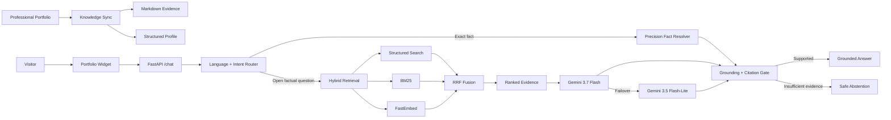

<div align="center">

# Ask Youssef AI

### Production AI Portfolio Copilot

**Hybrid Retrieval • Grounded Generation • Multilingual AI • Evaluation • Deployment**

A production AI system built by **Youssef Bouzit** that turns a professional portfolio into an interactive, evidence-grounded assistant for recruiters, clients, engineers and collaborators.

<br />

[](https://youssef-bt.github.io/)
[](https://ask-youssef-ai.vercel.app/)
[](https://youssef-bt.github.io/)
[](https://www.linkedin.com/in/youssef-bouzit-74863239b/)

<br />


</div>

---

## Project at a Glance

| Area | Implementation |
|---|---|
| **Purpose** | Make a professional engineering portfolio queryable through natural language |
| **Retrieval** | Structured profile + BM25 + FastEmbed semantic search + Reciprocal Rank Fusion |
| **Generation** | Gemini 3.7 Flash with Gemini 3.5 Flash-Lite failover |
| **Grounding** | Citation validation, unsupported-claim checks and safe abstention |
| **Backend** | FastAPI, Python 3.12, Server-Sent Events |
| **Languages** | English, French and Arabic |
| **Production** | Vercel + GitHub Actions |
| **Quality** | Unit, regression, adversarial, security and live production evaluation |

---

## Why I Built It

A strong engineering portfolio can contain projects, metrics, technologies, certifications, professional experience and technical documentation spread across many pages.

**Ask Youssef AI makes that information directly accessible through conversation.** A recruiter can ask for the strongest Computer Vision evidence, a client can inspect RAG experience, and an engineer can explore technical work without manually browsing the entire portfolio.

The important part is not only generating an answer. The system is designed to answer **from synchronized professional evidence**, distinguish exact facts from open-ended questions, validate important claims and abstain when the evidence is insufficient.

---

## System Architecture



The architecture intentionally separates **deterministic logic** from **generative reasoning**. Exact professional facts are resolved structurally; LLM generation is reserved for questions where interpretation and synthesis add value.

---

## Core Engineering Decisions

| Decision | Why it matters |
|---|---|
| **Hybrid retrieval instead of vector-only search** | Professional portfolios contain semantic concepts, exact names, technologies and identifiers; no single retrieval method handles all of them equally well. |
| **Deterministic precision facts** | Counts, employer checks, certification inventories and current-status questions should not depend on partial top-k context. |
| **Evidence before generation** | Factual portfolio questions require retrieved support before an answer is accepted. |
| **Grounding after generation** | Citations and important literals are checked against the evidence available for the turn. |
| **Safe abstention** | Missing evidence produces a limitation instead of an invented professional claim. |
| **Provider failover** | Transient model failures do not immediately break the visitor experience. |
| **Hard language contract** | The current question controls English/French/Arabic response language, including follow-up conversations. |
| **Privacy-aware observability** | Operational metrics are aggregate and do not intentionally retain visitor conversations. |

---

## Hybrid Retrieval

The retrieval layer combines three complementary signals:

```text
Structured Professional Profile
            +
           BM25
            +
   FastEmbed Semantic Search
            ↓
   Reciprocal Rank Fusion
            ↓
      Ranked Evidence
```

**Structured retrieval** is useful for entities and exact professional fields. **BM25** is strong for project names, companies and technical identifiers such as `YOLOv11s` or `BoT-SORT`. **FastEmbed** handles conceptual similarity when the visitor uses different wording from the portfolio.

RRF combines these rankings into one evidence set before generation.

---

## Grounded Professional Answers

The system is designed around one rule:

> **Professional claims should be connected to evidence.**

The response pipeline can validate or constrain:

- portfolio source identifiers;
- citations;
- important numeric claims;
- public URLs and contact information;
- employer and experience claims;
- project-specific technical facts;
- unsupported high-impact assertions.

Retrieved portfolio content is treated as **data, not instructions**, which also helps contain prompt-injection pressure from the knowledge source.

---

## Multilingual Experience

Ask Youssef AI supports:

<div align="center">

### English • Français • العربية

</div>

Language routing happens before generation, and the current visitor question determines the final response language. Technical names remain canonical where appropriate.

---

## Knowledge Base

The live portfolio is the professional source of truth. Synchronization generates both retrieval evidence and a structured profile for exact facts.

| Synchronized Entity | Current Snapshot |
|---|---:|
| Projects | **10** |
| Skill categories | **6** |
| Certifications | **56** |
| Professional experiences | **2** |
| Education entries | **2** |
| Public professional links | **4** |
| Evidence pages | **16** |
| Retrieval chunks | **161** |
| Structured documents | **81** |

---

## Evaluation & Quality

The project is validated through multiple independent layers rather than one vague accuracy number.

| Validation Layer | Verified Result |
|---|---:|
| Python unit & regression suite | **218 / 218** |
| Routing accuracy | **1.000** |
| Retrieval Hit@1 | **1.000** |
| Retrieval Hit@3 | **1.000** |
| Retrieval MRR | **1.000** |
| Grounding safety | **1.000** |
| Profile integrity | **1.000** |
| Career-state production regression | **3 / 3** |
| Core production regression | **25 / 25** |
| Deep adversarial production audit | **20 / 20** |
| Human recruiter/client/visitor audit | **21 / 21** |
| Targeted client regressions | **2 / 2** |

These results correspond to defined regression suites and deterministic evaluation contracts. They are **not** presented as a claim of universal 100% LLM accuracy.

See [`docs/evaluation.md`](docs/evaluation.md) for the full methodology.

---

## Production & Reliability

The public service runs on **Vercel** with a **FastAPI** backend and SSE streaming.

Production safeguards include:

- Gemini primary/fallback generation;
- bounded provider timeouts and retries;
- deterministic routes for questions that do not require generation;
- request and history size limits;
- public-origin controls;
- per-IP and global usage limits;
- synchronized bundled evidence;
- health and operational endpoints;
- automated CI and production regression workflows.

**Live health:** https://ask-youssef-ai.vercel.app/health

---

## Security Engineering

The project includes security controls at both application and software-supply-chain levels:

- server-side secret management;
- prompt and history boundaries;
- strict conversation roles;
- secret-exfiltration refusal;
- unsupported-claim protection;
- citation integrity checks;
- exact Python dependency pins;
- Dependabot;
- `pip-audit`;
- GitHub CodeQL;
- automated security regression tests.

More detail: [`SECURITY.md`](SECURITY.md) and [`docs/security.md`](docs/security.md).

---

## Technology Stack

<div align="center">


</div>

---

## Documentation

| Document | Purpose |
|---|---|
| [`docs/architecture.md`](docs/architecture.md) | System design and retrieval architecture |
| [`docs/evaluation.md`](docs/evaluation.md) | Evaluation methodology and quality gates |
| [`docs/security.md`](docs/security.md) | Security and privacy design |
| [`docs/deployment.md`](docs/deployment.md) | Production deployment architecture |
| [`SECURITY.md`](SECURITY.md) | Vulnerability reporting policy |

---

## Repository Structure

<details>
<summary><strong>View project structure</strong></summary>

<br />

```text
ASK-YOUSSEF-AI/
├── app.py
├── backend/
│   ├── app.py
│   ├── agent.py
│   ├── rag.py
│   ├── router.py
│   ├── grounding.py
│   ├── precision_facts.py
│   ├── structured_facts.py
│   ├── observability.py
│   ├── retrieval/
│   └── data/
├── evaluation/
├── tests/
├── scripts/
├── web/
├── docs/
├── .github/
├── requirements.txt
├── vercel.json
├── SECURITY.md
└── LICENSE
```

</details>

---

## About the Engineer

<div align="center">

### Youssef Bouzit

**State Engineer in Data Science**

AI / Machine Learning • Computer Vision • RAG / LLM Systems • MLOps

I build AI systems that connect **models, data, retrieval, backend engineering, evaluation and production delivery**.

<br />

[](https://youssef-bt.github.io/)
[](https://www.linkedin.com/in/youssef-bouzit-74863239b/)
[](https://github.com/YOUSSEF-BT)

</div>

---

<div align="center">

### Ask Youssef AI

**Evidence-grounded AI, engineered for a real production portfolio.**

</div>
