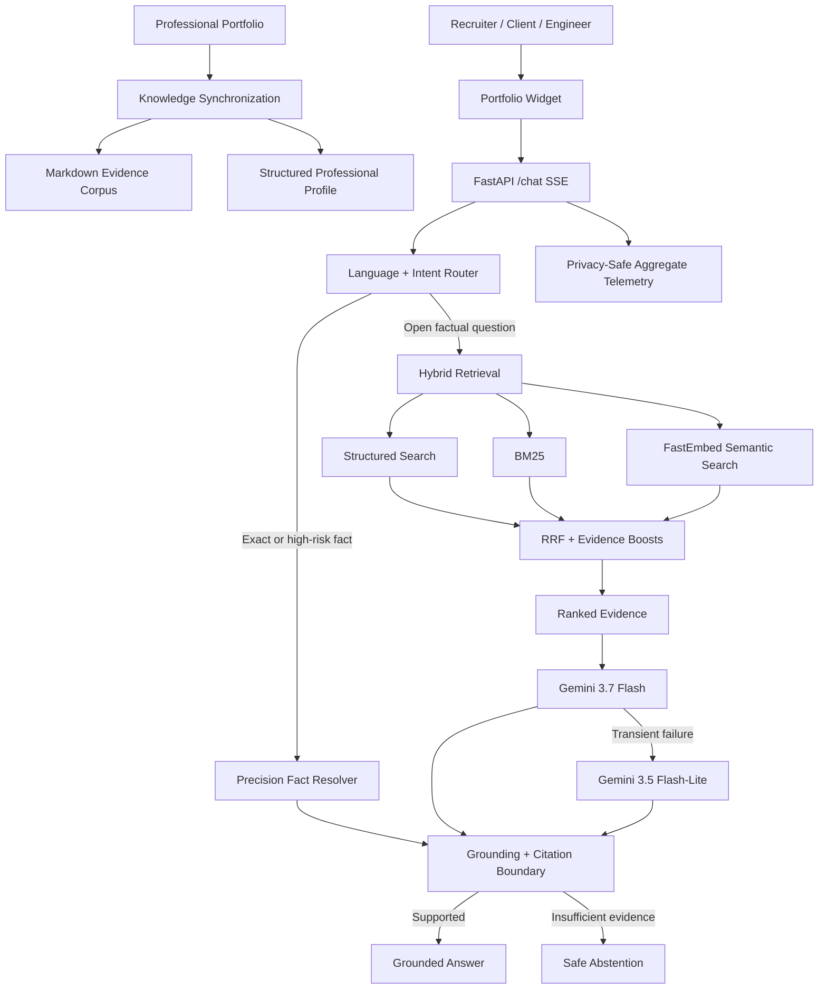

# System Architecture

Ask Youssef AI is designed as a production portfolio intelligence system rather than a prompt-only chatbot.

The system separates **knowledge synchronization, deterministic routing, hybrid retrieval, generative reasoning, grounding, observability and delivery** into explicit layers so each part can be tested and reasoned about independently.

## High-Level Architecture



## Design Goals

The architecture follows six principles:

1. **Evidence before claims** — factual professional answers should be connected to synchronized portfolio evidence.
2. **Deterministic precision where possible** — exact counts, inventories and employer checks should not depend on generative inference.
3. **Hybrid retrieval** — exact identifiers, structured entities and semantic concepts benefit from different retrieval methods.
4. **Safe failure behavior** — missing evidence or provider failure should not become fabricated professional claims.
5. **Observable production behavior** — runtime quality should be measurable without retaining visitor conversations.
6. **Separation of concerns** — retrieval, generation, grounding, synchronization and delivery remain independently testable.

## Source of Truth

The public professional portfolio is the authoritative source for public profile facts.

Synchronization produces complementary representations:

- `backend/data/site/` — Markdown evidence for lexical and semantic retrieval;
- `backend/data/profile.json` — structured entities for exact facts and field-aware retrieval;
- `career-status.md` — explicit current-status and availability evidence;
- `structured-profile.md` — citable aggregate profile facts;
- `manifest.json` — synchronization integrity metadata.

Current synchronized snapshot:

| Entity | Count |
|---|---:|
| Projects | 10 |
| Skill categories | 6 |
| Certifications | 56 |
| Professional experiences | 2 |
| Education entries | 2 |
| Public professional links | 4 |
| Evidence pages | 16 |
| Retrieval chunks | 161 |
| Structured documents | 81 |

## Routing Layer

`backend/router.py` classifies language, intent and portfolio scope before generation.

Important behaviors include:

- English, French and Arabic routing;
- factual portfolio questions requiring evidence;
- deterministic greeting and out-of-scope paths;
- hidden-prompt and secret-exfiltration refusal;
- history-aware follow-up handling;
- conservative handling of ambiguous professional questions.

The current visitor question controls the response language, even when previous turns use another language.

## Precision Fact Layer

`backend/precision_facts.py` and `backend/structured_facts.py` handle questions that should never depend on a partial retrieval window.

Typical examples:

- certification totals and issuer inventories;
- project, skill, experience and education counts;
- employer checks;
- issuer/employer disambiguation;
- current professional role;
- full-time/CDI availability;
- exact structured project facts.

This layer reads the complete synchronized profile and returns deterministic evidence-backed responses.

## Hybrid Retrieval Layer

Open factual questions use three complementary signals.

### Structured retrieval

Best for entities and professional fields such as employers, projects, technologies, certifications and contact links.

### BM25 lexical retrieval

Best for names and exact technical vocabulary such as `YOLOv11s`, `BoT-SORT`, company names and certification issuers.

### FastEmbed semantic retrieval

Best for conceptual similarity when the visitor uses different wording from the portfolio.

The candidate sets are combined with **Reciprocal Rank Fusion (RRF)** and bounded deterministic evidence boosts.

```text
Structured Search + BM25 + FastEmbed
                ↓
       Reciprocal Rank Fusion
                ↓
      Evidence-aware reranking
                ↓
          Ranked context
```

## Generation & Failover

The primary generation model is **Gemini 3.7 Flash**.

Transient quota, timeout or overload failures can switch generation to **Gemini 3.5 Flash-Lite**.

Generation is intentionally bypassed for deterministic cases such as exact structured facts, greetings and bounded scope responses.

If retrieval succeeds but generation still fails, the system prefers an evidence-based fallback instead of an unsupported answer.

## Grounding Boundary

`backend/grounding.py` acts as a model-independent trust boundary.

It can:

- validate returned source IDs;
- remove unknown citations;
- normalize canonical citations;
- constrain unsupported numeric, URL and email claims;
- detect unsupported high-impact professional assertions;
- replace unsupported claims with conservative abstention.

This is a deterministic safety boundary, not a claim of universal semantic theorem proving.

## API & Streaming

The production API uses FastAPI and Server-Sent Events.

```text
GET  /health
GET  /capabilities
GET  /pages
GET  /metrics
POST /chat
POST /feedback
```

The portfolio widget consumes `/chat` as an SSE stream.

## Observability

`backend/observability.py` records privacy-safe aggregate metrics such as:

- request counts;
- language and intent distribution;
- retrieval usage;
- grounding interventions;
- runtime errors;
- bounded latency statistics;
- aggregate feedback categories.

The system is not designed to retain visitor prompts, answers, IP addresses, email addresses or conversation history.

## Production Runtime

```text
Portfolio Widget
      ↓
Vercel FastAPI
      ↓
Python 3.12
      ↓
In-process Hybrid Retrieval
      ↓
Gemini Generation + Grounding
```

The FastEmbed model is prepared during build so production requests do not need to download the embedding model at runtime.

## Validation Layers

The architecture is protected by:

- unit and regression tests;
- deterministic routing/retrieval benchmarks;
- deployed career-state checks;
- strict core production regression;
- deep adversarial production audit;
- human recruiter/client/visitor evaluation;
- dependency vulnerability auditing;
- CodeQL static analysis.

See [`evaluation.md`](evaluation.md) for the evaluation contract and [`security.md`](security.md) for the security model.

## Deliberate Limits

The current project does not claim:

- arbitrary-question 100% accuracy;
- enterprise SLA availability;
- multi-region high availability;
- persistent distributed observability;
- distributed rate limiting;
- multi-tenant identity or RBAC.

Those capabilities should only be claimed after implementation and measurement.
