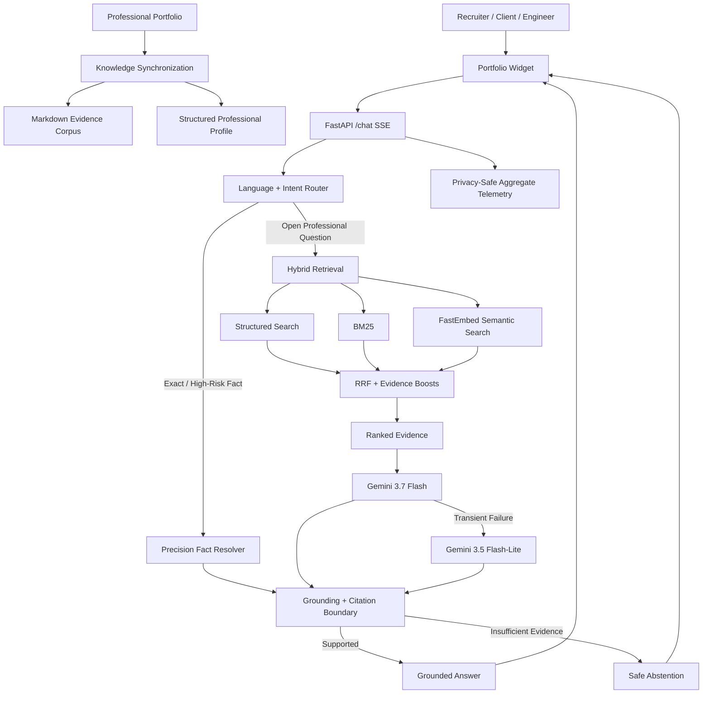

# Architecture

Ask Youssef AI is designed as a production portfolio intelligence system rather than a prompt-only chatbot.

The architecture separates **knowledge synchronization, deterministic routing, hybrid retrieval, generative reasoning, grounding, observability and delivery** into explicit layers.

## Production Architecture



## Architectural Goals

The system was designed around six engineering goals:

1. **Evidence before claims** — factual portfolio answers should be tied to synchronized professional evidence.
2. **Deterministic precision where possible** — exact counts, inventories and employment checks should not depend on probabilistic generation.
3. **Hybrid retrieval** — exact identifiers, semantic concepts and structured entities require different retrieval strengths.
4. **Safe failure behavior** — missing evidence or provider failure should not become fabricated professional claims.
5. **Production observability** — runtime behavior should be measurable without storing visitor conversations.
6. **Clear separation of concerns** — retrieval, generation, grounding, delivery and synchronization remain independently testable.

## Source of Truth

The public professional portfolio is the authoritative source for public profile facts.

Synchronization produces complementary representations:

- `backend/data/site/` — Markdown evidence used by lexical and semantic retrieval;
- `backend/data/profile.json` — structured entities used for exact facts and field-aware retrieval;
- `career-status.md` — explicit public availability and current-status evidence;
- `structured-profile.md` — citable aggregate profile facts;
- `manifest.json` — integrity metadata for synchronized content.

Current synchronized production snapshot:

| Entity | Count |
|---|---:|
| Projects | 10 |
| Skill categories | 6 |
| Certifications | 56 |
| Professional experiences | 2 |
| Education entries | 2 |
| Public professional links | 4 |
| Evidence pages | 16 |
| Retrieval chunks | 161 |
| Structured documents | 81 |

## Deterministic Routing

`backend/router.py` classifies language, intent and portfolio scope before generation.

The router protects several behaviors:

- English, French and Arabic routing;
- factual profile questions requiring evidence;
- greeting and out-of-scope fast paths;
- private/prompt/secret requests;
- history-aware follow-ups;
- conservative handling of ambiguous profile questions.

The current visitor question controls response language, even when earlier conversation context is in another language.

## Precision Fact Layer

`backend/precision_facts.py` and `backend/structured_facts.py` resolve questions that should never depend on a partial retrieval window.

Examples include:

- certification totals;
- Oracle certification inventory;
- project, skill, experience and education counts;
- employer checks;
- issuer/employer disambiguation;
- current professional role;
- full-time/CDI availability;
- exact structured project facts.

This layer reads the complete synchronized profile and returns deterministic evidence-backed responses.

## Hybrid Retrieval

Open factual questions use three signals:

### 1. Structured profile retrieval

Best for entities and fields such as employers, project metadata, technologies, certifications and contact links.

### 2. BM25 lexical retrieval

Best for exact identifiers, names and technical vocabulary such as `YOLOv11s`, `BoT-SORT`, company names and certification issuers.

### 3. FastEmbed semantic retrieval

Best for conceptual similarity when the visitor's language differs from the exact wording used in the portfolio.

The candidate sets are fused with **Reciprocal Rank Fusion (RRF)** and bounded deterministic evidence boosts.

```text
Structured Search + BM25 + FastEmbed
                ↓
       Reciprocal Rank Fusion
                ↓
      Evidence-aware reranking
                ↓
          Ranked context
```

## Generation and Provider Failover

The primary model is **Gemini 3.7 Flash**.

Transient quota, timeout or overload failures can switch generation to **Gemini 3.5 Flash-Lite**.

Generation is intentionally not used for every request. Deterministic greetings, scope responses and exact structured facts bypass the model when possible.

If retrieval succeeds but generation fails, the system prefers an evidence-based fallback over an unsupported answer.

## Grounding and Citation Boundary

`backend/grounding.py` acts as a model-independent trust boundary.

It can:

- validate returned source IDs;
- remove unknown citations;
- normalize canonical citations;
- block unsupported numeric, URL and email claims where applicable;
- detect unsupported high-impact professional assertions;
- replace unsupported claims with evidence-based abstention.

This is a deterministic safety boundary, not a claim of universal semantic theorem proving.

## API and Streaming

The production API is implemented with FastAPI and Server-Sent Events.

Important endpoints:

```text
GET  /health
GET  /capabilities
GET  /pages
GET  /metrics
POST /chat
POST /feedback
```

The visitor-facing widget consumes `/chat` as an SSE stream.

## Observability

`backend/observability.py` records privacy-safe aggregate metrics such as:

- request counts;
- language and intent distribution;
- retrieval usage;
- grounding interventions;
- runtime errors;
- bounded latency statistics;
- aggregate feedback categories.

The system is not designed to retain visitor prompts, answers, IP addresses, email addresses or conversation history.

## Production Runtime

The active production path is:

```text
Portfolio Widget
      ↓
Vercel FastAPI
      ↓
Python 3.12
      ↓
In-process Hybrid Retrieval
      ↓
Gemini Generation + Grounding
```

The FastEmbed model is prepared during build so production requests do not need to download the embedding model at runtime.

## Quality Architecture

The repository validates the architecture at multiple layers:

- unit and regression tests;
- deterministic routing/retrieval benchmark;
- deployed career-state checks;
- core production regression;
- adversarial production audit;
- human recruiter/client/visitor evaluation;
- dependency vulnerability auditing;
- CodeQL static analysis.

See [`evaluation.md`](evaluation.md) for the evaluation contract.

## Security Boundaries

Key boundaries include:

- secrets remain server-side;
- frontend code contains only the public API URL;
- retrieved content is treated as data, not instructions;
- request and history sizes are bounded;
- history roles are validated;
- browser origins are restricted;
- unsupported professional claims are refused rather than guessed;
- hidden-prompt and secret-exfiltration requests are rejected.

See [`security.md`](security.md) for the full security model.

## Deliberate Limits

The project does not claim:

- universal semantic entailment verification;
- arbitrary-question 100% accuracy;
- persistent distributed observability;
- enterprise-scale load guarantees;
- enterprise SLA availability;
- multi-tenant identity or RBAC.

Those would require additional infrastructure and should only be claimed after implementation and measurement.
