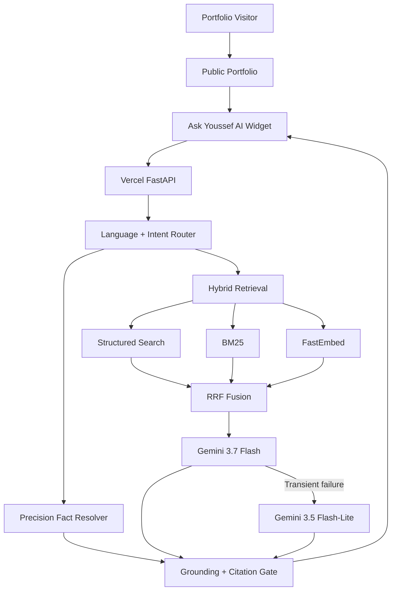

# Production Deployment

Ask Youssef AI is deployed as a production portfolio service on Vercel and integrated directly into Youssef Bouzit's public portfolio.

## Production Topology



The frontend and backend are deliberately separated so provider credentials never reach the browser.

## Live Services

- **Portfolio:** `https://youssef-bt.github.io/`
- **Production API:** `https://ask-youssef-ai.vercel.app/`
- **Health:** `https://ask-youssef-ai.vercel.app/health`
- **Capabilities:** `https://ask-youssef-ai.vercel.app/capabilities`
- **API docs:** `https://ask-youssef-ai.vercel.app/docs`

Current health snapshot:

```text
ok=true
pages=16
chunks=161
structured_docs=81
retrieval=semantic+bm25+structured-rrf
transport=inprocess
brain=Gemini gemini-3.7-flash
```

## Runtime

The root `app.py` is the Vercel production entrypoint.

Production uses:

```text
Python 3.12
FastAPI
Server-Sent Events
MCP_TRANSPORT=inprocess
EMBEDDER=fastembed
FASTEMBED_MODEL=BAAI/bge-small-en-v1.5
GEMINI_MODEL=gemini-3.7-flash
GEMINI_FALLBACK_MODEL=gemini-3.5-flash-lite
ALLOWED_ORIGINS=https://youssef-bt.github.io
```

`requirements.txt` uses exact direct dependency pins to reduce rebuild drift.

## Secret Management

The generative path requires a server-side provider key:

```text
GEMINI_API_KEY
```

It belongs only in Vercel environment variables and must never be:

- committed to Git;
- exposed through frontend code;
- placed in a public `VITE_*` variable;
- returned through SSE;
- written into public telemetry.

## Knowledge Assets

Production uses synchronized assets committed under:

```text
backend/data/site/
backend/data/profile.json
```

The portfolio remains the public professional source of truth.

Synchronization updates:

- evidence pages;
- projects;
- skills;
- certifications;
- experience;
- education;
- current career status;
- public professional links;
- structured aggregates.

## Build Strategy

The Vercel build prepares the FastEmbed model before runtime so visitor requests do not download the embedding model during cold start.

The deployed function therefore starts with:

- synchronized portfolio data;
- local semantic model assets;
- Python 3.12;
- exact direct dependency pins;
- a prevalidated FastAPI entrypoint.

## Public API

```text
GET  /health
GET  /capabilities
GET  /pages
GET  /metrics
POST /chat
POST /feedback
```

`/chat` uses Server-Sent Events to stream the assistant workflow without requiring a WebSocket layer.

## Reliability Controls

Production includes:

- deterministic routing before generation;
- exact structured-fact handling;
- in-process hybrid retrieval;
- bounded provider timeouts and retries;
- Gemini primary/fallback generation;
- evidence-based fallback behavior;
- request-size limits;
- bounded conversation history;
- browser-origin restrictions;
- per-IP and global usage limits;
- health checks and runtime observability.

Exact structured questions can bypass the generative model entirely.

## CI/CD & Quality Gates

Runtime-affecting changes are protected by:

1. **CI** — compilation, unit/regression tests, synchronized-data validation and deterministic benchmark.
2. **Security** — `pip-audit` and GitHub CodeQL.
3. **Career-state regression** — validates current work and full-time/CDI positioning.
4. **Core production regression** — validates the public end-to-end API contract.
5. **Deep adversarial audit** — searches for multilingual, grounding, privacy and prompt-related regressions.

Current verified production results:

| Validation | Result |
|---|---:|
| Career-state regression | **3 / 3** |
| Core production regression | **25 / 25** |
| Deep adversarial audit | **20 / 20** |

See [`evaluation.md`](evaluation.md) for methodology and scope.

## Portfolio Integration

The portfolio loads the production widget from this repository and points it to:

```text
https://ask-youssef-ai.vercel.app
```

No provider secret is embedded in the frontend.

## Rollback Strategy

If a future runtime change regresses production:

1. restore the previous known-good deployment or revert the faulty commit;
2. verify `/health`;
3. inspect build and runtime logs;
4. reproduce the failure through the appropriate regression suite;
5. fix the root cause;
6. require the affected CI, security and evaluation gates to pass again.

Evaluation thresholds should not be weakened merely to make a failing change pass.

## Deployment Scope

The current service is a **production portfolio system**. It does not claim enterprise SLA, multi-region high availability, distributed rate limiting or multi-tenant authorization.
