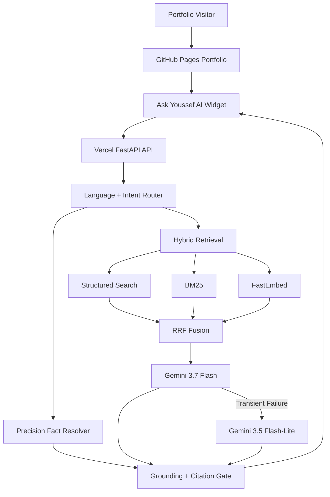

# Production Deployment

Ask Youssef AI is deployed as a production portfolio service on Vercel and integrated directly into Youssef Bouzit's public portfolio.

## Production Topology



The frontend and backend are deliberately separated so provider credentials never reach the browser.

## Active Production Service

- Portfolio: `https://youssef-bt.github.io/`
- API: `https://ask-youssef-ai.vercel.app/`
- Health: `https://ask-youssef-ai.vercel.app/health`
- Capabilities: `https://ask-youssef-ai.vercel.app/capabilities`
- API docs: `https://ask-youssef-ai.vercel.app/docs`

The production deployment is currently healthy and reports:

```text
ok=true
pages=16
chunks=161
structured_docs=81
retrieval=semantic+bm25+structured-rrf
transport=inprocess
brain=Gemini gemini-3.7-flash
```

## Runtime Configuration

The root `app.py` is the Vercel production entrypoint.

Production uses:

```text
Python 3.12
FastAPI
Server-Sent Events
MCP_TRANSPORT=inprocess
EMBEDDER=fastembed
FASTEMBED_MODEL=BAAI/bge-small-en-v1.5
GEMINI_MODEL=gemini-3.7-flash
GEMINI_FALLBACK_MODEL=gemini-3.5-flash-lite
ALLOWED_ORIGINS=https://youssef-bt.github.io
```

`requirements.txt` uses exact direct dependency pins so rebuilds do not silently absorb incompatible future releases.

## Secret Management

Generation requires a server-side provider key:

```text
GEMINI_API_KEY
```

The secret belongs only in the Vercel environment-variable store.

It must never be:

- committed to Git;
- placed in frontend source;
- exposed through a `VITE_*` variable;
- returned through SSE;
- written into public logs or telemetry.

## Knowledge Assets

Production uses committed synchronized knowledge assets:

```text
backend/data/site/
backend/data/profile.json
```

The portfolio repository remains the public source of truth.

The synchronization pipeline updates:

- evidence pages;
- project metadata;
- skills;
- certifications;
- experience;
- education;
- career status;
- public professional links;
- structured aggregates.

## Build Strategy

The Vercel build prepares the FastEmbed model before runtime so visitor requests do not need to download it on cold start.

The production function therefore starts with:

- synchronized portfolio data;
- local semantic model assets;
- exact Python runtime;
- pinned direct dependencies;
- FastAPI application entrypoint already validated.

## Production API

```text
GET  /health
GET  /capabilities
GET  /pages
GET  /metrics
POST /chat
POST /feedback
```

`/chat` returns Server-Sent Events so the widget can expose model/retrieval progress without a WebSocket dependency.

## Reliability Controls

The active production path includes:

- deterministic routing before generation;
- exact structured-fact handling;
- in-process hybrid retrieval;
- bounded provider timeouts;
- bounded generation retries;
- Gemini primary/fallback models;
- evidence-based fallback behavior;
- request-size limits;
- bounded conversation context;
- public-origin restrictions;
- per-IP and global abuse limits;
- production health checks.

Exact structured questions can bypass generation completely.

## Production Quality Gates

Runtime changes are protected by multiple validation layers:

1. **CI** — compilation, unit/regression tests, synchronized-data checks and deterministic benchmark.
2. **Security** — `pip-audit` and GitHub CodeQL.
3. **Career-state regression** — validates current work and full-time/CDI positioning.
4. **Core production regression** — validates end-to-end public API behavior.
5. **Deep adversarial audit** — searches for multilingual, grounding, privacy and prompt-related regressions.

Current verified results:

| Production Validation | Result |
|---|---:|
| Career-state regression | **3 / 3** |
| Core production regression | **25 / 25** |
| Deep adversarial audit | **20 / 20** |

See [`evaluation.md`](evaluation.md) for full scope and interpretation.

## Portfolio Integration

The live portfolio contains `src/components/AskYoussefAI.jsx` and loads the production widget from:

```text
https://cdn.jsdelivr.net/gh/YOUSSEF-BT/ASK-YOUSSEF-AI@main/web/widget.js
```

The production API defaults to:

```text
https://ask-youssef-ai.vercel.app
```

No model/provider secret is embedded in the frontend.

## CI/CD Flow

```text
ASK-YOUSSEF-AI main
      |
      +--> GitHub Actions CI
      +--> Security checks
      +--> Vercel production deployment for runtime changes
      +--> Deployed production evaluation

Portfolio main
      |
      +--> React/Vite build
      +--> GitHub Pages publication
      +--> Widget connects to Vercel API
```

Documentation-only changes are intentionally separated from runtime deployment triggers where possible to avoid unnecessary production builds.

## Rollback Strategy

If a future runtime change regresses production:

1. restore the previous known-good deployment or revert the faulty commit;
2. verify `/health`;
3. inspect build/runtime logs;
4. reproduce the failure through the appropriate regression suite;
5. fix the root cause;
6. require the affected CI/security/evaluation gates to pass again.

Evaluation thresholds should not be weakened merely to make a failing change pass.

## Hosting Scope

The current deployment is intentionally positioned as a **production portfolio/demo system**.

It does not claim enterprise SLA, multi-region high availability, distributed rate limiting or multi-tenant authorization.
