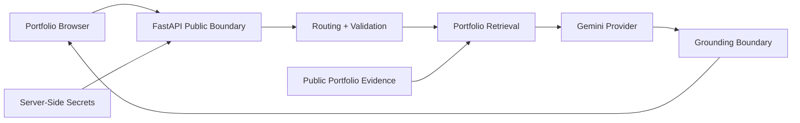

# Security & Privacy Architecture

Ask Youssef AI is a public AI portfolio system. Its security model focuses on four objectives:

1. protect provider credentials and internal configuration;
2. limit abusive use of a public AI endpoint;
3. prevent unsupported professional claims from being treated as trusted facts;
4. avoid retaining unnecessary visitor data.

The design is intentionally strong for a public portfolio application while avoiding enterprise-grade claims that are not implemented.

## Trust Boundaries

Key boundaries:

- the browser is untrusted input;
- FastAPI is the public API boundary;
- portfolio snapshots contain public professional evidence only;
- provider credentials remain server-side;
- retrieved content is treated as evidence, never as executable instructions;
- generated claims pass through deterministic grounding controls before delivery.

## Input Controls

The API applies inexpensive controls before expensive model work:

- **origin allowlist** for the production portfolio;
- **question-size limit**;
- **bounded conversation history**;
- **strict message roles** allowing only `user` and `assistant`;
- **per-IP request limits**;
- **global usage cap**;
- **serialized shared-agent execution** where required.

These controls reduce accidental abuse and free-tier provider exhaustion.

## Secret Management

Sensitive provider configuration belongs only in server-side environment variables.

Examples include:

- `GEMINI_API_KEY`;
- future provider tokens;
- future contact-provider credentials;
- future database or analytics secrets.

Secrets must never be:

- committed to Git;
- embedded in frontend JavaScript;
- returned through SSE;
- included in public telemetry;
- exposed through prompt or configuration requests.

The browser receives only the public API base URL.

## Prompt and Secret Exfiltration

Requests for hidden prompts, internal instructions, private reasoning, API keys or configuration secrets are refused.

Where possible, these are handled through deterministic public routes rather than relying on a model to decide whether disclosure is safe.

Retrieved portfolio text is always considered **data**, not privileged instruction text.

## Grounding as a Trust Boundary

The assistant does not trust a generated sentence merely because the LLM produced it.

`backend/grounding.py` can:

- validate citations against evidence returned during the turn;
- remove unknown citations;
- normalize canonical source identifiers;
- verify high-risk numeric, URL and email literals where applicable;
- reject unsupported high-impact professional claims;
- replace unsafe claims with conservative abstention.

This layer is deliberately described as a deterministic safety boundary, not universal semantic verification.

## Structured Facts and Hallucination Reduction

Exact questions are resolved directly from structured professional data when possible.

Examples include:

- certification totals;
- Oracle certification inventory;
- project counts;
- experience counts;
- employer checks;
- current role;
- full-time/CDI availability.

This reduces unnecessary generative risk for information that can be answered deterministically.

## CORS and Browser Embedding

Production browser access is restricted to the approved portfolio origin through `ALLOWED_ORIGINS`.

Origin/Referer checks help prevent unauthorized embedding and accidental provider usage.

This is a browser-layer control rather than user authentication: non-browser clients can forge headers.

## Rate Limiting

The public API includes process-local controls for:

- per-minute usage;
- per-day usage;
- global daily usage.

These controls are appropriate for the current portfolio-scale deployment.

A multi-instance commercial service would require a shared persistent rate-limit store.

## Privacy-Safe Observability

Operational telemetry is aggregate only.

The service is not designed to retain:

- visitor prompts;
- model answers;
- conversation history;
- email addresses;
- IP addresses;
- arbitrary free-text feedback.

Telemetry focuses on:

- request counts;
- language/intent distributions;
- retrieval usage;
- grounding interventions;
- error counts;
- bounded latency statistics;
- predefined feedback categories.

`/metrics` must never expose prompts, answers, secrets, raw traces or personal data.

## Dependency and Supply-Chain Security

The production dependency strategy includes:

- Python `3.12` pinned through `.python-version`;
- exact direct versions in `requirements.txt`;
- weekly Dependabot monitoring;
- `pip-audit` on pushes, pull requests and schedule;
- GitHub CodeQL v4 static analysis;
- CI compilation and regression tests;
- synchronized profile/corpus integrity validation.

Exact direct pins prevent a future dependency release from silently changing production behavior during rebuild.

Dependabot proposes controlled upgrades that must pass CI/security gates before acceptance.

## Security Validation

Security-related regression coverage includes:

- hidden-prompt extraction attempts;
- API-key/secret requests;
- invalid history roles;
- unsupported citations;
- false employer claims;
- unsupported private details;
- public API boundaries;
- synchronized data integrity;
- dependency vulnerability scanning;
- static code analysis.

## Responsible Disclosure

Vulnerability reports should follow [`../SECURITY.md`](../SECURITY.md).

Reports containing sensitive exploit details should not be opened publicly.

## Remaining Production-Scale Limits

The current project does not claim an enterprise security architecture.

A future commercial or multi-tenant version would still require, as appropriate:

- persistent distributed rate limiting;
- authenticated administration;
- RBAC;
- durable centralized audit logs;
- formal secret-rotation procedures;
- stronger network/environment isolation;
- multi-tenant data boundaries;
- broader dynamic application-security testing;
- operational alerting and incident response processes.

Documenting these limits is intentional: security claims should remain connected to implemented controls.
