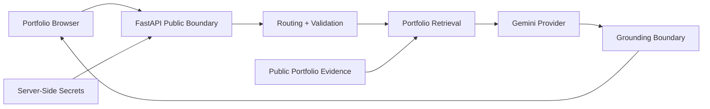

# Security & Privacy Architecture

Ask Youssef AI is a public AI portfolio system. Its security model is designed around four goals:

1. protect provider credentials and internal configuration;
2. limit abuse of a public AI endpoint;
3. prevent unsupported professional claims from becoming trusted facts;
4. minimize retention of visitor data.

The design is intentionally strong for a public production portfolio system while avoiding enterprise-grade claims that are not implemented.

## Trust Boundaries

Key boundaries:

- the browser is untrusted input;
- FastAPI is the public API boundary;
- synchronized portfolio data contains public professional evidence only;
- provider credentials remain server-side;
- retrieved content is treated as evidence, not instructions;
- generated claims pass through grounding controls before delivery.

## Input Controls

The API applies inexpensive controls before expensive model work:

- production origin allowlist;
- maximum question length;
- bounded conversation history;
- strict `user` / `assistant` history roles;
- per-IP request limits;
- global usage cap;
- serialized shared-agent execution where required.

These controls reduce accidental abuse and provider exhaustion.

## Secret Management

Sensitive configuration belongs only in server-side environment variables.

Examples include:

- `GEMINI_API_KEY`;
- future provider tokens;
- future contact-provider credentials;
- future database or analytics secrets.

Secrets must never be:

- committed to Git;
- embedded in frontend JavaScript;
- exposed through SSE;
- included in public telemetry;
- returned through prompt or configuration requests.

The browser receives only the public API base URL.

## Prompt & Secret Exfiltration

Requests for hidden prompts, private instructions, internal reasoning, API keys or configuration secrets are refused.

Where possible, these are handled through deterministic routes rather than relying on a generative model to decide whether disclosure is safe.

Retrieved portfolio text is always treated as **data**, not privileged instruction text.

## Grounding as a Trust Boundary

`backend/grounding.py` can:

- validate citations against evidence available for the turn;
- remove unknown citations;
- normalize canonical source identifiers;
- constrain high-risk numeric, URL and email literals;
- reject unsupported high-impact professional claims;
- replace unsupported claims with conservative abstention.

This layer is a deterministic safety boundary, not universal semantic verification.

## Structured Facts & Hallucination Reduction

Exact questions are resolved directly from structured professional data when possible.

Examples include:

- certification totals;
- issuer-specific inventories;
- project and experience counts;
- employer checks;
- current role;
- full-time/CDI availability.

This removes unnecessary generative risk for information that can be answered deterministically.

## CORS & Browser Embedding

Production browser access is restricted through `ALLOWED_ORIGINS`.

Origin/Referer checks reduce unauthorized embedding and accidental provider usage.

This is a browser-layer control rather than authentication; non-browser clients can forge headers.

## Rate Limiting

The public API includes process-local controls for:

- per-minute usage;
- per-day usage;
- global daily usage.

These controls are appropriate for the current portfolio-scale deployment.

A commercial multi-instance service would require a shared persistent rate-limit store.

## Privacy-Safe Observability

Operational telemetry is aggregate only.

The service is not designed to retain:

- visitor prompts;
- model answers;
- conversation history;
- email addresses;
- IP addresses;
- arbitrary free-text feedback.

Telemetry focuses on:

- request counts;
- language and intent distribution;
- retrieval usage;
- grounding interventions;
- error counts;
- bounded latency statistics;
- predefined feedback categories.

`/metrics` must never expose prompts, answers, secrets, raw traces or personal data.

## Dependency & Supply-Chain Security

The production dependency strategy includes:

- Python `3.12` pinned through `.python-version`;
- exact direct versions in `requirements.txt`;
- weekly Dependabot monitoring;
- `pip-audit` on pushes, pull requests and schedule;
- GitHub CodeQL v4 static analysis;
- CI compilation and regression tests;
- synchronized profile/corpus integrity validation.

Exact direct pins reduce rebuild drift. Dependency upgrades should pass CI and security gates before acceptance.

## Security Validation

Security-related regression coverage includes:

- hidden-prompt extraction attempts;
- API-key and secret requests;
- invalid history roles;
- unsupported citations;
- false employer claims;
- unsupported private details;
- public API boundaries;
- synchronized data integrity;
- dependency vulnerability scanning;
- static code analysis.

## Responsible Disclosure

Vulnerability reports should follow [`../SECURITY.md`](../SECURITY.md).

Reports containing sensitive exploit details should not be published publicly.

## Current Limits

The project does not claim enterprise security architecture.

A future commercial or multi-tenant version would still require, as appropriate:

- distributed rate limiting;
- authenticated administration;
- RBAC;
- durable centralized audit logs;
- formal secret rotation;
- stronger network/environment isolation;
- multi-tenant data boundaries;
- broader dynamic application-security testing;
- operational alerting and incident response processes.

Security claims should remain connected to implemented controls.
